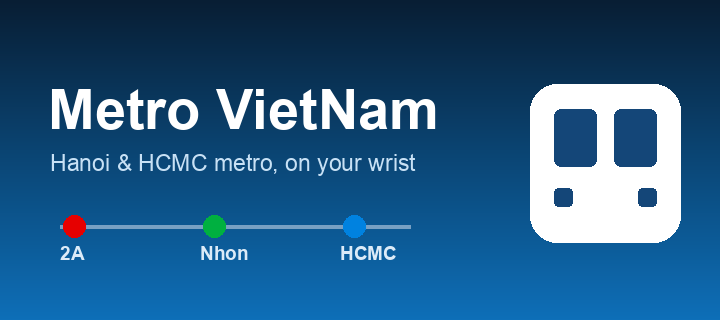
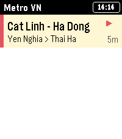
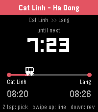
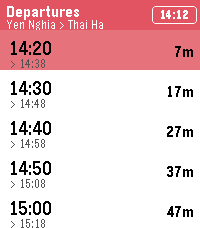
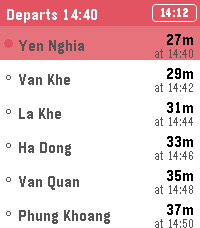
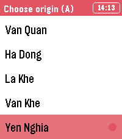
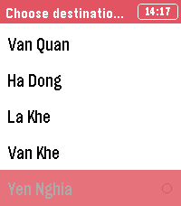

<p align="center">
  
</p>
<h1 align="center">Metro VietNam</h1>

<p align="center">
  <strong>Track Hanoi & Ho Chi Minh City metro from your wrist.</strong><br>
  <strong>Pick your trip A → B, watch the next train count down, get a buzz before it arrives.</strong>
</p>

<p align="center">
  <a href="https://github.com/dungngminh/pebble_metro_vietnam/releases/latest"></a>
  <a href="https://github.com/dungngminh/pebble_metro_vietnam/actions/workflows/build.yml"></a>
  
  
  
</p>

<p align="center">
  
</p>

<!-- Store description -->
A Pebble watchapp that tracks Vietnam's three operating metro lines — Cat Linh–Ha Dong, Nhon–Cau Giay (Hanoi) and Ben Thanh–Suoi Tien (HCMC). Choose the lines you ride on your phone, pick an origin → destination on the watch, and a live countdown shows when the next train reaches your station. Pin upcoming departures to the timeline with a reminder before each one arrives.
<!-- Store description end -->

```
Hanoi 2A · Nhon–Cau Giay · HCMC Line 1 · Live countdown · A→B trip · Full-line ETA · Timeline pins · Touch + buttons
```

### Screenshots

| Lines | Countdown | Departures |
|---|---|---|
|  |  |  |

| Full line (per departure) | Pick origin (A) | Pick destination (B) |
|---|---|---|
|  |  |  |

### Features

- **Live countdown:** Pick a station and see minutes:seconds until the next train, with a moving train riding the A → B track.
- **A → B trips:** Choose an origin and a destination; the app shows the departure time at A and the arrival at B, plus a per-stop ETA for the whole line.
- **Reverse instantly:** Flip the trip end-to-start with one gesture.
- **Timeline + reminders:** Push the next departures to the Pebble timeline and buzz a few minutes before the train arrives.
- **Three real lines built in:** Operating hours and peak/off-peak headways for all three VN metro lines, working fully offline once synced.
- **Made for Pebble Time 2:** Touchscreen gestures and physical buttons both work; animated splash, marquee for long names, and a status glyph (▶ running / ⏸ closed).

### Why

Vietnam's metros publish **no public realtime/GTFS API** — only operating hours and a fixed headway. Metro VietNam bakes that schedule in and computes *estimated* next-train times on the phone, so the watch keeps counting down even offline. Times are labelled **scheduled**; per-stop ETA assumes ~2 min between stations.

### Controls (detail screen)

| Action | Button | Touch |
|---|---|---|
| Pick route A → B | `SELECT` | Double tap |
| Full line + ETA | `UP` | Swipe up |
| Reverse A ↔ B | `DOWN` | Swipe down |
| Back | `BACK` | Swipe across |

- **Line list:** `SELECT` or tap a line to open it.
- **Station picker / Full line:** scroll with `UP`/`DOWN` or drag; tap a station to choose it.

### Settings (phone)

Open the app's settings on your phone (Pebble app → Metro VietNam):

- **Tracked lines** — which of the three lines to follow.
- **Departures to pin** — how many upcoming trains go to the timeline (0–6).
- **Remind before arrival** — buzz/reminder before the train arrives.
- **Show intro animation** — toggle the startup splash.

### Install

**From a release:**

Download the latest `metro-vietnam.pbw` and install it via the Pebble phone app, or:

```bash
pebble install --phone <phone-ip>
```

### Building

Requires the [Pebble SDK](https://developer.repebble.com) (`pebble` tool v5) and Node.js.

```bash
pebble build                       # build all target platforms
pebble install --emulator emery    # run on the Pebble Time 2 emulator
```

Project layout:

```
src/c/        C watchapp (UI, animation, countdown, touch)
src/pkjs/     PebbleKit JS (timetable data, Clay config, timeline pins)
tools/        Python generators for icons & store assets
store/        Appstore banner, icons, screenshots
```

CI builds the `.pbw` on every push — see [.github/workflows/build.yml](.github/workflows/build.yml).

### Contributing

1. Fork this repository.
2. Create a branch, make your changes (`pebble build` to verify).
3. Open a Pull Request.

Timetable data lives in [`src/pkjs/timetable.js`](src/pkjs/timetable.js) — update operating hours, headways or station lists there.

### License

MIT — see [LICENSE](LICENSE)
